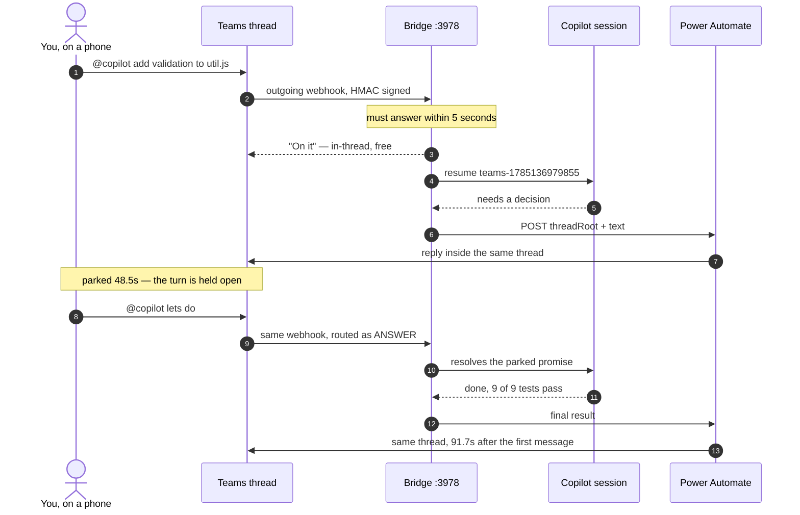

# Receipts

The measured numbers behind [Code from Teams](../README.md), and what a single turn
actually does end to end.

Kept out of the README on purpose. The README is for deciding whether you want this and
then setting it up; this is for the reader who wants the evidence first.

## The numbers

Every number here comes from a run that is logged in
[FINDINGS.md](FINDINGS.md) — none of it is a projection.

| | |
|---:|---|
| **91.7s** | one full turn against real Teams: ask → clarify → wait → work → report |
| **48.5s** | the agent parked mid-turn while the user was away, holding the turn open — no polling, no keepalive |
| **7** | tools auto-approved in that turn, nothing blocked |
| **`"lets do #1"`** | routed as an *answer* to the parked question, not as a new prompt |
| **5s** | the inbound webhook window, which is hard, and which we always answer inside |
| **0** | databases, mapping tables, or state files. The session id is derived from the thread |
| **6 weeks** | age of the oldest session on disk that still resumes with full context |
| **15/15** | outbound posts in the soak test, zero failures |
| **1460 → 694** | characters in the same answer, before and after the voice prompt — and the long one pasted a diff at someone who was driving |

---

## One turn, end to end

<!-- Rendered by GitHub natively. The two arrows back into Teams are deliberately
     different: that asymmetry is the whole architecture. -->

Inbound and outbound are **different mechanisms**, and that asymmetry is the single most
important thing to understand here — [How it works](../README.md#how-it-works) in the
README is why.
